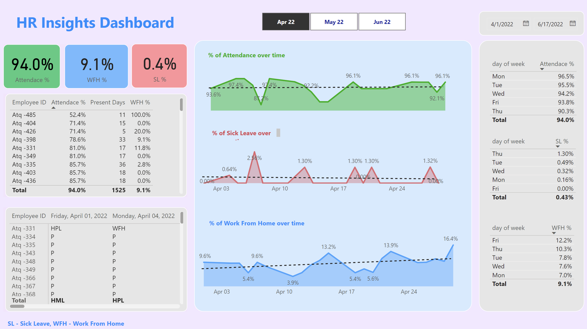

# HR Insights Dashboard - Power BI Project

This repository contains a Power BI dashboard project designed to provide insights into HR-related metrics such as employee attendance, work from home (WFH) percentages, and sick leave (SL) percentages. The dashboard helps HR teams monitor and analyze employee trends over time, enabling data-driven decision-making.

## Overview

The **HR Insights Dashboard** focuses on three key metrics:

- **Attendance %**: The percentage of employees who were present during the selected period.
- **WFH %**: The percentage of employees working from home.
- **SL %**: The percentage of employees who took sick leave.

The dashboard offers visual representations of these metrics over time, making it easier to track fluctuations, analyze trends, and identify areas for improvement.



## Features

1. **Attendance, WFH, and SL metrics**: Displays overall attendance, WFH, and SL percentages for the selected date range.
2. **Trend Analysis**:
   - Attendance, WFH, and SL trends over time, represented by line graphs.
   - Breakdown of metrics by day of the week for more granular insights.
3. **Employee Breakdown**:
   - List of employee-specific data, including attendance percentage, present days, and WFH percentage.
4. **Date Range Selection**: Allows users to filter the dashboard by custom date ranges.
5. **Sick Leave and WFH Trends**: Visualizations show peaks and dips in WFH and SL across different time periods.
6. **Detailed Daily Data**:
   - Displays specific employee data for selected days.
   - Employee status (e.g., WFH, HML, HPL) for each day is available for detailed tracking.

## How to Use

### Prerequisites

- **Power BI Desktop**: Ensure you have Power BI Desktop installed on your machine. You can download it from [here](https://powerbi.microsoft.com/desktop).

### Running the Dashboard

1. Clone this repository to your local machine.
   ```bash
   git clone https://github.com/de-pesh/HR-Data-Analysis-and-Dashboard.git
